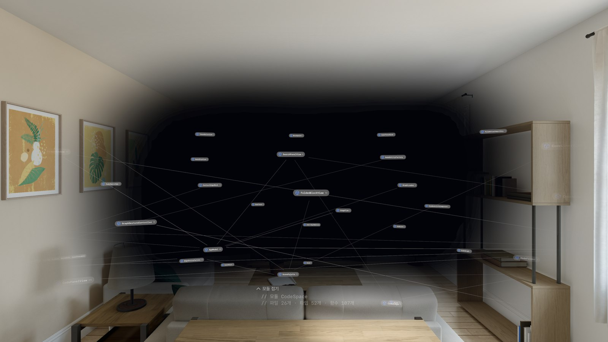
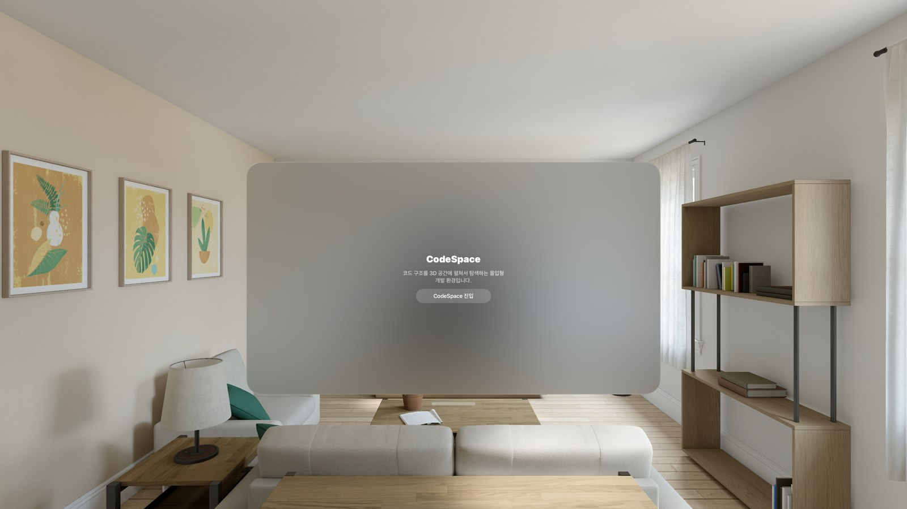
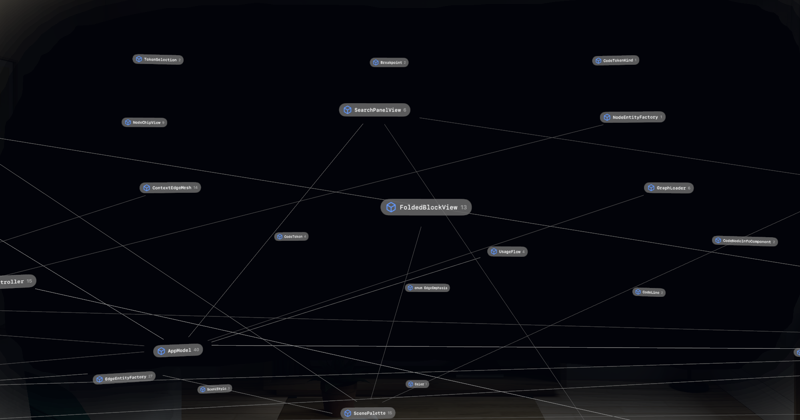
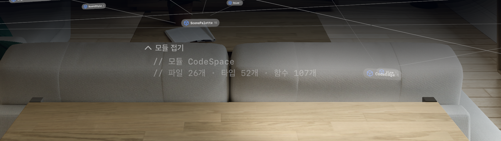

# CodeSpace

**코드 구조를 3D 공간에 펼쳐서 탐색하는 visionOS 몰입형 개발 환경입니다.**

[Primitive](https://primitive.io)의 공간 기반 코드 시각화 UX를 Apple Vision Pro 네이티브 기술(SwiftUI + RealityKit + ARKit)로
재해석한 프로젝트입니다. 윈도우나 볼륨의 경계 없이 `ImmersiveSpace` 안에서 실제 Swift 소스 코드를 3D 그래프로 펼치고,
토큰 단위로 쓰임새를 추적하며, 손 제스처만으로 확대·회전·탐색합니다.

<p align="center">
  
  
</p>
<p align="center">
  
  
</p>

> 스크린샷은 visionOS 시뮬레이터에서 캡처했습니다. 실제 Apple Vision Pro에서는 몰입 배경·손 트래킹·주시 회피 등이
> 훨씬 자연스럽게 보입니다.

---

## 무엇을 하는 앱인가

이 프로젝트 자체(Swift 파일 26개, 노드 392개, 엣지 531개)를 CodeSpace로 열면:

- **타입·함수가 3D 공간에 노드로 배치**됩니다. 모듈 카드가 정면에, 타입 칩들이 사용자를 중심으로 한 호(arc) 위에
  호출 관계의 깊이만큼 뒤로 물러나며 펼쳐집니다.
- **칩을 탭하면 제자리에서 코드가 열립니다.** 타입 칩을 펼치면 그 자리에서 타입 카드와 멤버 목록이 나타나고,
  펼친 블록마다 옅은 형광 테두리로 서로 구분됩니다.
- **코드는 토큰 단위로 상호작용**합니다. 변수·함수 이름을 탭하면 그 심볼을 실제로 참조하는 모든 노드가 강조되고,
  엣지가 흐름을 따라 흐릅니다. 문자열 일치가 아니라 SwiftSyntax 인덱서가 만든 심볼 참조표로 해석합니다.
- **엣지의 색·속도·방향이 의미를 가집니다.** 소유·호출·오류 전파·종료 경로가 서로 다른 시각 언어로 표현되고,
  브레이크포인트를 걸면 그 지점에서 멈춘 흐름이 점멸합니다.
- **바라보는 카드의 글자를 엣지가 가리지 않습니다.** ARKit 머리 방향으로 "지금 읽고 있는 카드"를 추정해,
  그 위를 지나는 엣지를 곡선으로 비켜가게 하고 시선을 옮기면 다시 직선으로 되돌립니다.
- **`catch` / `guard-else` 같은 예외 경로는 Z축으로 접혀 있습니다.** 평소엔 헤더 줄만 보이다가, 카드를 기울이면
  뒤로 접힌 본문이 드러나는 3축 코드 배치입니다.
- **심볼 검색**으로 원하는 타입·함수를 바로 찾아 펼치고 흐름을 강조할 수 있습니다.

## 주요 기능

| 영역 | 내용 |
| --- | --- |
| 공간 셋업 | `ImmersiveSpace` + `RealityView`, `.progressive` 몰입 스타일(디지털 크라운으로 5~100% 조절), 시스템 라이트/다크 모드 자동 반영 |
| 제스처 | 시선과 무관하게 동작하는 두 손 확대/축소·자유 회전(HIG 표준 핀치), 한 손 드래그 이동, 모드 잠금으로 충돌 방지 |
| 코드 표현 | 테두리·배경 없는 순수 텍스트 카드, 구문 강조, 토큰 단위 호버·탭, 거터의 브레이크포인트·오류·종료 자동 표식 |
| 흐름 시각화 | 엣지 종류(소유/호출/오류 전파/종료)별 색·속도·방향, 브레이크포인트 일시정지 점멸, 소유 체인(담김) 파란 곡선 |
| Z축 코드 접힘 | `catch`/`guard-else` 본문을 카드 뒤로 78°로 접어 3축 코드 배치를 구현 |
| 대규모 대응 | SwiftSyntax 빌드 타임 인덱서로 실제 소스 인덱싱, 시맨틱 줌(칩↔카드), 배치 라인 메시로 컨텍스트 엣지 렌더링, 심볼 검색 |
| 주시 회피 | ARKit 기기 자세로 주시 카드를 추정해 그 위를 지나는 엣지·라인을 곡선으로 비켜가게 함 |

## 아키텍처

```
Tools/CodeSpaceIndexer      실제 Swift 소스를 SwiftSyntax로 파싱 → 노드/엣지/심볼표 JSON 생성 (별도 Swift 패키지)
Spatial_IDE_ForVisionOS/
├── Models/                 CodeGraph, GraphIndex(조회 캐시), UsageFlow(심볼 기반 쓰임새 해석), CodeTokenizer, CodeFolder
├── Layout/                 SpatialLayout — 호 배치, 의존 층 깊이, 제자리 펼침, 블록 테두리 계산
├── Rendering/               GraphSceneController(증분 씬 갱신), EdgeEntityFactory(엣지 시각 언어),
│                            ContextEdgeMesh(LowLevelMesh 배치 렌더링), HeadPoseTracker(ARKit 주시 추정)
├── Views/                   CodePanelView/CodeLinesView(코드 카드), NodeChipView, SearchPanelView, GraphGestureController
└── Resources/               CodeSpaceGraph.json (인덱서 산출물), SampleGraph.json (더미 폴백)
Docs/
├── PRD_CodeSpace.md         전체 요구사항 및 마일스톤
└── Tasks/PhaseN_*.md        단계별 태스크 문서·설계 메모·트러블슈팅 기록
```

데이터 파이프라인은 `GraphLoader`가 `CodeSpaceGraph.json`(인덱서 산출물) → `SampleGraph.json`(손으로 쓴 더미) →
`CodeGraph.sample`(코드에 박힌 최후 폴백) 순으로 시도합니다.

## 요구 사항

- Xcode 26 이상, visionOS 27.0+ SDK
- 실기기 테스트: Apple Vision Pro (visionOS 27)
- 인덱서 재실행: Swift 6 툴체인 (Swift Package Manager로 `swift-syntax` 601.0.0+ 를 받습니다)

## 시작하기

```bash
# 1. Xcode에서 열기
open Spatial_IDE_ForVisionOS.xcodeproj

# 2. 실행 대상을 Apple Vision Pro(시뮬레이터 또는 실기기)로 선택 후 빌드·실행
```

앱을 실행하면 먼저 최소 런처 윈도우가 뜹니다. visionOS는 첫 연결 시 항상 Shared Space 씬을 요구하므로
(Apple HIG 권고사항), "CodeSpace 진입" 버튼을 눌러야 몰입 공간이 열립니다.

### 실제 코드를 다시 인덱싱하기

`CodeSpaceGraph.json`은 이 저장소 자체 소스를 인덱싱한 결과입니다. 코드를 바꾼 뒤 그래프를 갱신하려면:

```bash
cd Tools/CodeSpaceIndexer
swift run codespace-indexer ../../Spatial_IDE_ForVisionOS --module CodeSpace \
  -o ../../Spatial_IDE_ForVisionOS/Resources/CodeSpaceGraph.json
```

다른 프로젝트를 열어보고 싶다면 `<소스 루트>`와 `--module` 값만 바꿔서 실행하면 됩니다.

## 문서

전체 요구사항과 각 단계의 설계 결정·트러블슈팅은 [`Docs/PRD_CodeSpace.md`](Docs/PRD_CodeSpace.md)와
[`Docs/Tasks/`](Docs/Tasks) 아래 Phase별 문서에 상세히 기록되어 있습니다.

| Phase | 내용 |
| --- | --- |
| 1 | ImmersiveSpace 공간 셋업 및 기본 렌더링 |
| 2 | 노드 연결 엣지 및 SwiftUI 어태치먼트 |
| 3 | 공간 인터랙션(제스처, 토큰 호버/선택) |
| 4 | 실제 데이터 바인딩(JSON) 및 엣지 흐름 시각화 |
| 5 | Z축 코드 접힘(3축 코드 배치) |
| 6 | 대규모 코드베이스 대응(인덱서, 시맨틱 줌, 배치 렌더링, 주시 회피) |

## 알려진 한계

- visionOS는 시선(눈) 좌표를 앱에 제공하지 않습니다. "주시 회피"는 ARKit 머리 방향으로 근사한 것이라
  고개는 고정한 채 눈만 옆으로 굴리면 따라오지 않습니다.
- 인덱서의 심볼 해석은 완전한 타입 체커가 아닌 이름·스코프 기반 근사치입니다. 완전한 해석은 IndexStoreDB(USR)
  연동으로 대체할 수 있습니다(후속 과제).
- 멀티 모듈/모노레포는 모듈별로 따로 인덱싱해야 하며, 모듈 간 참조 해석은 아직 지원하지 않습니다.

## 라이선스

TBD
